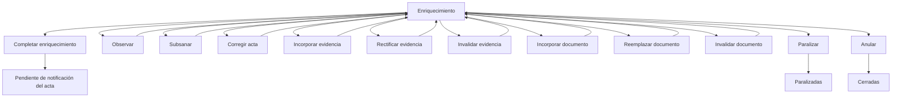

# [CANONICO] BANDEJA — ENRIQUECIMIENTO

# Estado
Canónico en validación funcional

# Última actualización
2026-04-06

# Propósito
Definir qué muestra la bandeja de enriquecimiento, qué casos entran, qué acciones humanas pueden ejecutarse allí y qué efectos produce cada acción sobre el recorrido del acta.

# Relación con otros documentos
- `spec/03-catalogos/01-estados-acta.md`
- `spec/03-catalogos/02-tipos-evento-acta.md`
- `spec/04-snapshot/01-campos-snapshot-operativo.md`
- `spec/04-snapshot/02-reglas-derivacion.md`
- `spec/04-snapshot/03-transiciones.md`
- `spec/05-bandejas/01-bandeja-labradas.md`

---

# 1. Nombre de la bandeja

**Enriquecimiento**

---

# 2. Objetivo

Mostrar las actas que requieren trabajo administrativo de completitud, revisión, incorporación de datos, evidencia o documentación antes de quedar listas para continuar el circuito principal.

Esta bandeja representa la etapa en la que la Dirección de Faltas completa o consolida administrativamente el caso para dejarlo en condiciones de seguir avanzando.

---

# 3. Qué se muestra

La bandeja debería mostrar, como mínimo:

- número o referencia principal del acta
- fecha y hora de labrado
- competencia o materia principal del caso
- tipo o naturaleza principal del acta
- estado actual
- último hito relevante
- observaciones o alertas de revisión, si existieran
- evidencia o documentación faltante/relevante, si aplica
- datos mínimos identificatorios del caso

No hace falta todavía definir columnas exactas finales; en esta fase importa validar la lógica operativa.

---

# 4. Qué casos entran

Entran aquí los casos cuya situación dominante sea compatible con:

- `EstadoActa = EN_ENRIQUECIMIENTO`

o que, por decisión operativa de la Dirección de Faltas, requieran una etapa de completitud o consolidación administrativa antes de pasar a notificación.

Típicamente llegan aquí desde:

- `Actas Labradas / Revisión Inicial`

---

# 5. Qué se espera resolver aquí

En esta bandeja se espera resolver si el acta:

- queda suficientemente completa
- requiere correcciones
- requiere incorporación de evidencia
- requiere incorporación de documentos
- requiere observación o subsanación
- debe quedar lista para notificación
- debe paralizarse
- excepcionalmente debe anularse

En términos simples: aquí se busca “dejar el caso listo para seguir”.

---

# 6. Acciones posibles

## 6.1 Completar enriquecimiento
- **Evento o proceso que dispara:** `ACTA_ENRIQUECIDA`
- **Resultado esperado:** el caso queda suficientemente consolidado para seguir el circuito
- **Destino:** `Pendiente de notificación del acta` / D3

## 6.2 Observar
- **Evento o proceso que dispara:** `ACTA_OBSERVADA`
- **Resultado esperado:** el caso queda marcado con observación administrativa o material que requiere tratamiento
- **Destino:** normalmente sigue en `Enriquecimiento`, a validar con el área

## 6.3 Subsanar observación
- **Evento o proceso que dispara:** `ACTA_SUBSANADA`
- **Resultado esperado:** se corrige la observación previa y el caso vuelve a situación de enriquecimiento normal
- **Destino:** sigue en `Enriquecimiento` o queda listo para completar enriquecimiento, a validar con el área

## 6.4 Corregir acta
- **Evento o proceso que dispara:** `ACTA_CORREGIDA`
- **Resultado esperado:** se ajustan datos relevantes del acta dentro de esta etapa
- **Destino:** sigue en `Enriquecimiento`

## 6.5 Incorporar evidencia
- **Evento o proceso que dispara:** `EVIDENCIA_INCORPORADA`
- **Resultado esperado:** se agrega evidencia relevante para completar el caso
- **Destino:** sigue en `Enriquecimiento`

## 6.6 Rectificar evidencia
- **Evento o proceso que dispara:** `EVIDENCIA_RECTIFICADA`
- **Resultado esperado:** se corrige o sustituye evidencia previamente incorporada
- **Destino:** sigue en `Enriquecimiento`

## 6.7 Invalidar evidencia
- **Evento o proceso que dispara:** `EVIDENCIA_INVALIDADA`
- **Resultado esperado:** determinada evidencia deja de ser válida o útil
- **Destino:** sigue en `Enriquecimiento`, salvo que cambie el criterio del caso

## 6.8 Incorporar documento
- **Evento o proceso que dispara:** `DOCUMENTO_INCORPORADO`
- **Resultado esperado:** se agrega documentación relevante para completar la etapa
- **Destino:** sigue en `Enriquecimiento`

## 6.9 Reemplazar documento
- **Evento o proceso que dispara:** `DOCUMENTO_REEMPLAZADO`
- **Resultado esperado:** se sustituye un documento por otro válido
- **Destino:** sigue en `Enriquecimiento`

## 6.10 Invalidar documento
- **Evento o proceso que dispara:** `DOCUMENTO_INVALIDADO`
- **Resultado esperado:** un documento deja de tener validez operativa en esta etapa
- **Destino:** sigue en `Enriquecimiento`, salvo que requiera otra revisión

## 6.11 Paralizar
- **Evento o proceso que dispara:** `PARALIZACION_DISPUESTA`
- **Resultado esperado:** el caso deja el circuito activo normal
- **Destino:** `Paralizadas`

## 6.12 Anular excepcionalmente
- **Evento o proceso que dispara:** `ACTA_ANULADA`
- **Resultado esperado:** el caso queda invalidado y sale del circuito normal
- **Destino:** `Cerradas`

---

# 7. Excepciones

Esta bandeja puede tener excepciones o cuestiones a validar:

- puede haber observaciones que no saquen al caso de esta misma bandeja
- puede haber subsanaciones que se resuelvan sin cambiar de estación
- algunas materias o tipos de acta podrían requerir enriquecimiento mínimo
- otras podrían requerir enriquecimiento bastante más intenso
- debe validarse si toda observación vive en esta misma bandeja o si alguna requiere otro manejo operativo
- debe validarse si una anulación desde aquí es posible y con qué nivel de excepcionalidad

---

# 8. Mini diagrama simple

# 9. Puntos a validar con Dirección de Faltas
¿Enriquecimiento existe efectivamente como estación de trabajo separada?
¿Qué significa exactamente “enriquecer” para el área?
¿Toda acta que entra aquí debe salir necesariamente a notificación del acta?
¿Observar y subsanar viven dentro de esta misma bandeja?
¿La incorporación de evidencia y documentos ocurre realmente aquí?
¿Hay tipos de acta que casi no pasan por esta bandeja?
¿La anulación desde enriquecimiento existe en la práctica y en qué casos?
¿Falta alguna acción relevante propia de esta etapa?

# 10. Resultado esperado de validación

- Después de validar esta bandeja debería quedar claro:

si EN_ENRIQUECIMIENTO alcanza como estado dominante para esta estación
qué acciones forman realmente parte de esta etapa
si observar/subsanar/corregir viven aquí o requieren otro tratamiento
si toda salida normal desde aquí va a Pendiente de notificación del acta
si hace falta distinguir subtipos de enriquecimiento por materia o tipo de acta
si los catálogos de eventos actuales alcanzan para representar esta estación sin agregar complejidad innecesaria
